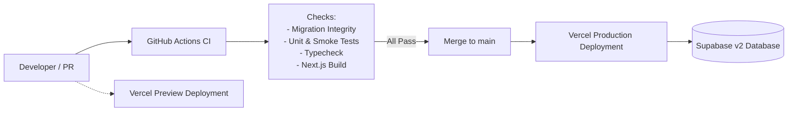

# GreenBridge v2 — CI/CD & Deployment Guide

This document describes the deployment architecture, CI/CD pipeline, and operational release procedures for GreenBridge v2.

---

## 1. Architecture Overview



GreenBridge v2 comprises:
- **Application Layer**: Next.js 16 (React 19) App Router deployed to **Vercel**.
- **Data & Auth Layer**: **Supabase** (PostgreSQL with PostGIS, Row-Level Security, and Auth).
- **Automation & CI/CD**: **GitHub Actions** for automated validation and pull request gating.

---

## 2. GitHub Actions CI Pipeline

The CI workflow is configured in `.github/workflows/ci.yml` and triggers on:
- Any pull request targeting `main`.
- Direct pushes to `main`.

### Pipeline Jobs & Quality Gates

1. **`ci` Job (Blocking Quality Gate)**:
   - **Environment**: Ubuntu Latest with Node.js 20.x LTS.
   - **Step 1: Install Dependencies**: `npm ci` ensures exact locked dependency installation.
   - **Step 2: Migration Validation**: `npm run validate:migrations` ensures migrations `001_v2...` through `014_v2...` are complete, ordered, and non-empty.
   - **Step 3: Test Suite**: `npm test` runs all unit, integration, and smoke tests (Vitest).
   - **Step 4: Typecheck**: `npm run typecheck` verifies full TypeScript strict compliance across the entire project.
   - **Step 5: Production Build**: `npm run build` compiles all Next.js pages and API routes with placeholder environment variables.

2. **`lint` Job (Informational Report)**:
   - Runs `npm run lint` with `continue-on-error: true`.
   - Reports pre-existing code style diagnostics without blocking mission-critical deployments.

---

## 3. Environment Configuration

All environment variables must be configured in Vercel (Project Settings → Environment Variables):

### Client-Side Variables (Exposed to Browser)
| Variable | Required | Description | Example |
|---|---|---|---|
| `NEXT_PUBLIC_SUPABASE_URL` | Yes | Supabase Project URL | `https://xxxx.supabase.co` |
| `NEXT_PUBLIC_SUPABASE_PUBLISHABLE_KEY` | Yes | Supabase Modern Anon/Public Key | `eyJhbGciOi...` |
| `NEXT_PUBLIC_SUPABASE_ANON_KEY` | Optional | Legacy alias for anon key | `eyJhbGciOi...` |
| `NEXT_PUBLIC_APP_URL` | Yes | Public Web URL | `https://greenbridge.vn` |

### Server-Side Secrets (CRITICAL: Never Expose with `NEXT_PUBLIC_`)
| Variable | Required | Description | Security Note |
|---|---|---|---|
| `SUPABASE_SERVICE_ROLE_KEY` | Yes | Supabase Admin Service Key | **CRITICAL**: Bypasses RLS. Server-only. |

### Optional External Services
| Variable | Required | Description | Default |
|---|---|---|---|
| `NOMINATIM_BASE_URL` | No | Geocoding service base URL | `https://nominatim.openstreetmap.org` |
| `OSRM_BASE_URL` | No | Routing engine base URL | `https://router.project-osrm.org` |

---

## 4. Vercel Deployment Workflow

1. **Preview Deployments**:
   - Every GitHub Pull Request generates an ephemeral Vercel Preview URL.
   - Preview deployments connect to the staging database or preview Supabase branch.

2. **Production Deployment**:
   - Merging a PR into `main` automatically triggers a production deployment on Vercel.
   - Deployments are immutable and atomic.

3. **Vercel Configuration (`vercel.json`)**:
   ```json
   {
     "$schema": "https://openapi.vercel.sh/vercel.json",
     "framework": "nextjs"
   }
   ```

---

## 5. Supabase Database Deployment & Rollback Strategy

1. **Pre-Deployment Migration Integrity Check**:
   Always run the migration integrity and ordering validation script before applying migrations to any database:
   ```bash
   npm run validate:migrations
   ```
   *Note: This script validates file existence, sequential numbering (001–014), and structure. Live schema execution is performed in staging/production databases.*

2. **Staging Verification**:
   - Apply migrations `001_v2...` through `014_v2...` to the Staging environment first.
   - Run end-to-end verification and smoke tests.

3. **Production Application**:
   - Apply migrations to Production via `supabase db push` or sequential SQL execution in Supabase Dashboard.
   - See [SUPABASE_SETUP.md](SUPABASE_SETUP.md) for full migration details.

4. **Rollback & Safety Guidelines**:
   - All migrations are additive or backward-compatible wherever possible.
   - In case of a critical migration issue, identify the affected migration index and apply a compensating forward migration (e.g. `015_v2_fix_...sql`).

---

## 6. Deployment Verification & Smoke Testing

After deploying to any environment (staging or production), run the automated smoke verification:

### 1. Automated Health Check Endpoint
Query the `/api/health` endpoint:
```bash
curl -i https://<DEPLOYED_URL>/api/health
```
Expected response:
```json
{
  "status": "healthy",
  "version": "2.0.0",
  "environment": "production",
  "timestamp": "2026-09-29T..."
}
```

### 2. CI/Local Smoke Tests
Run the dedicated smoke suite:
```bash
npx vitest run tests/unit/smoke.test.ts
```
The smoke suite asserts:
- Health check route returns healthy status.
- Service role secret is isolated from browser client prefixes.
- Unauthenticated access to admin routes is strictly rejected.
- All 14 database migration files exist, are sequential, and contain expected SQL DDL.
